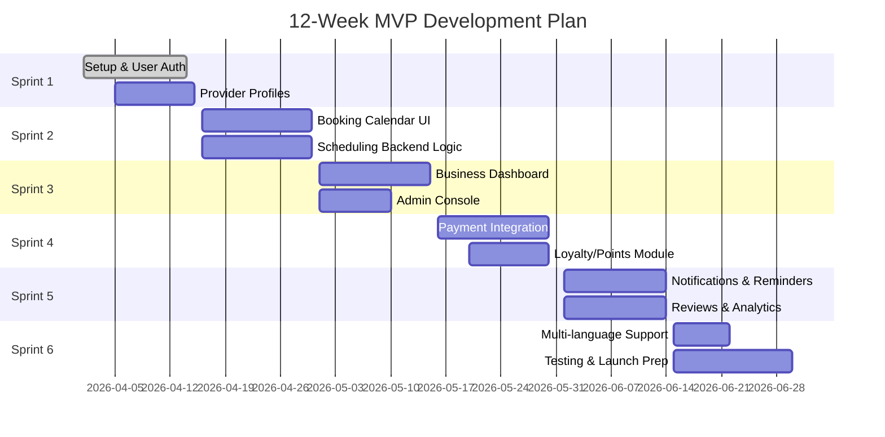

# Executive Summary

Sri Lanka’s service sector (salons, clinics, government offices, etc.) relies heavily on manual appointment scheduling – often by phone or walk‑in – causing delays and lost opportunities.  A centralized Appointment Scheduler App can save time for consumers and SMEs by offering 24/7 online booking, automated reminders, and streamlined workflows.  This report analyzes the market need (highlighting frustrations with *“multiple visits and paperwork”*【83†L41-L49】), defines user personas (customers, small business owners, government clerks), and surveys local competitors (e.g. OrderNow Bookings, industry apps, WhatsApp-based systems).  We review regulatory constraints (digital payments via GovPay/LankaPay【97†L28-L37】) and adoption barriers (rural connectivity, language diversity) and propose a detailed product spec, technical architecture, monetization models (with revenue projections), go-to-market strategy, operations plan, MVP roadmap, budget scenarios, risk mitigations, compliance checklist, and metrics dashboard.  The goal is a fully actionable plan, with an executive summary of findings and clear references to Sri Lankan sources throughout.

## Market Need & User Personas

**Pain Points:** Sri Lankans routinely face inefficient appointment processes【83†L41-L49】. For example, citizens report that accessing services (e.g. licenses, permits, doctor visits) often requires *multiple visits and paperwork*【83†L41-L49】. Similarly, small businesses (salons, clinics, workshops) struggle with phone/WhatsApp bookings: they frequently miss calls or double-book appointments. Consumers lose time waiting in queues; businesses lose revenue from no-shows and disorganized calendars. There is a clear demand for a simple digital scheduling tool that works in Sinhala, Tamil, and English, and handles low-bandwidth/mobile-only environments【83†L41-L49】【95†L137-L144】.

**User Personas:** 
- *Consumers:* Primarily urban and peri-urban smartphone users (ages 18–50) who book services on the go. They value convenience (book anytime), reminders (avoid missing slots), and trust (verified businesses). Rural users may rely on feature phones or community support, so SMS/USSD fallbacks are needed【95†L137-L144】【52†L101-L109】. 
- *SMEs (Salons, Clinics, Small Shops, Government Counters):* Often family-run or small teams (1–5 staff). These businesses want to streamline bookings, reduce no-shows, and accept digital payments. They range from tech-savvy owners to novices; thus the app must be extremely user-friendly. Government service counters and NGOs offering appointments (e.g. vocational training centers) also benefit from online queuing. Adoption will hinge on low setup effort and clear ROI (saved time, fewer empty slots).

## Competitor Landscape

Several solutions exist, but none are ubiquitous. OrderNow Bookings (by AlphinTech) is a prominent local platform “built for any service business” (salons, clinics, restaurants, tutoring centers, etc.)【101†L565-L570】. It boasts **500+ Sri Lankan businesses** (from beauty studios to medical clinics) and offers 24/7 online booking with SMS reminders【101†L599-L604】. Its plans start at **LKR 19,800/month** (~US$50) for 3 staff【101†L458-L466】. Other local or regional tools (Saptify, Fresha) exist but have limited Sri Lankan uptake. In practice, many SMEs still use **manual or ad-hoc methods**: paper diaries, WhatsApp messages, or phone call lists. Even tech-forward salons often rely on shared Google Calendars or social media messaging. No major global app focuses on the Sri Lankan market specifically, so there is room for a tailored solution. *Manual workflows*: Many clinics and govt counters use token systems or walk-in queues, with minimal digital booking; some smaller shops simply collect contact numbers. This fragmentation indicates low customer switching cost if a better app arrives.

## Regulatory & Payment Constraints

Sri Lanka’s digital payment infrastructure is evolving. The central bank’s LankaPay network supports interbank transfers and QR payments (LankaQR)【97†L28-L37】【95†L131-L139】. In early 2025, the government launched **GovPay**, enabling online payment for ~700 government services【97†L28-L37】. GovPay currently integrates with 13 banks and 6 fintech apps【97†L49-L56】, and plans to add card payments soon【97†L119-L122】. For our app, merchant payments can leverage LankaPay APIs (via a PSP partner) or existing e-wallets (FriMi, Genie). If integrating with government (e.g. booking at public hospitals), users could pay via GovPay. Data privacy is governed by Sri Lanka’s Personal Data Protection Act (in drafting) and existing regulations, so the app must securely handle personal/health data (see Privacy section). There are no licensing barriers for booking apps specifically, but online payment facilitation may require fintech approvals if handling e-money.   No language is prohibited, but multi-language support (Sinhala/Tamil/English) is essential given official trilingual policy【83†L41-L49】.

## Adoption Barriers

Key hurdles include **connectivity and literacy**. Over 80% of the population is rural【95†L137-L144】, where internet is less reliable. Many users still prefer feature phones; SMS or USSD reminders/fallbacks can bridge gaps. Low smartphone models dominate, so the app must be lightweight (progressive web or basic Android). English fluency is limited outside urban areas, so full **Sinhala and Tamil interfaces** are needed. In rural markets, trust-building is essential: partnerships with local authorities (e.g. clinic networks) and on-ground onboarding will drive usage. Urban users expect digital convenience, but persuading them to switch from call/WhatsApp scheduling requires a superior user experience and incentives. Payment trust can be a barrier – users should ideally prepay or deposit with escrow-like security to protect both parties.  

## Product Specifications

### Core Features

- **User App (Consumers):** Service selection (by category/location), interactive calendar with available slots, one-click booking, SMS/Push/email confirmations, reminders. View/manage upcoming appointments. Basic profile (name, contact, language). Payment integration (wallet or card) optional at booking or pay-on-arrival option. 
- **Business App (SMEs):** Dashboard for staff calendars, appointment management (confirm, reschedule, cancel), customer database, SMS/email notifications. Ability to define services, staff members, working hours, and buffer times. Analytics (daily bookings, no-show rate). 
- **Self-Serve Web Portal:** Most features accessible via web and mobile browser (no install needed). 
- **Admin Panel:** Super-admin console for support staff to verify businesses, resolve disputes, and manage content.

### Advanced Features

- **Multi-branch and Staff Roles:** Support for businesses with multiple branches or providers. Staff login to manage personal schedules. 
- **Packages & Memberships:** Prepaid bundles (e.g. salon membership, clinic package) with built-in expiry and usage tracking. 
- **Calendar Sync & Payments:** Sync with Google/Outlook Calendar for staff; integrate with LankaPay/UPI for in-app payments; accept GovPay if used by government agencies. 
- **Automated Reminders:** Scheduled SMS or app notifications 24/48 hours before appointment (reducing no-shows). 
- **Reviews/Rating:** After service completion, prompt users to rate and review, helping build trust. 
- **Referral & Rewards:** Simple loyalty program (e.g. referral credits, or “book 5th appointment free”). 
- **Offline/Low-bandwidth Mode:** The app should store critical data on-device for slow connections. Key pages (service listings, appointment form) can pre-load. 
- **SMS/USSD Fallback:** If no internet, a user can dial a short code or SMS keyword to query available slots and book via text (limited UI). Alternatively, the system confirms bookings via SMS menus. 
- **Language Support:** Full translation in Sinhala, Tamil, and English, with in-app toggle and locale detection. 

### User & Business UX Flows

- **Consumer Flow:** 
  1. Launch app → select service category (e.g. “Hair Salon” or “Government Office – Passport”).  
  2. Browse providers or choose one. View profile (services, photos, ratings).  
  3. Select date/time from calendar.  
  4. Enter details (name, phone, notes), confirm booking.  
  5. Receive SMS/email confirmation & reminders.  
  6. On arrival, optional payment via app or pay onsite.  
  7. After service, prompt to review.  

- **Business Flow:** 
  1. Sign up / register business (verify phone, address, ownership documents).  
  2. Enter service offerings and staff schedules (one-time setup via mobile/web).  
  3. View incoming appointment requests (accept/auto-accept settings).  
  4. Manage calendar: reschedule or cancel with notification.  
  5. Review analytics: daily bookings count, cancellation rate, peak times.  
  6. Export reports or sync with back-office software.  

*User Booking Flowchart:*  
```mermaid
flowchart LR
    A[User opens app] --> B[Select service provider]
    B --> C[View calendar & pick slot]
    C --> D[Confirm details & payment option]
    D --> E[Receive confirmation (SMS/app)]
    E --> F[Visit provider on time]
    F --> G[App prompts for review]
```  

## Technical Architecture

- **Frontend:** A responsive web app (HTML/JS/CSS) or hybrid mobile apps (Android/iOS) built with a framework like React/Vue. The consumer and business interfaces can share code (single-page app).  
- **Backend:** Cloud-based RESTful API server (Node.js, Python, or similar) on AWS/Azure/GCP or local data center. Use serverless where possible (AWS Lambda, Firebase) for scalability.  
- **Database:** Relational DB (MySQL/Postgres) for user data, schedules, transactions. NoSQL (e.g. Firebase Realtime DB) could handle chat or caching if needed. 
- **Calendar & Notifications:** Use a calendar microservice (or integrate Google Calendar API) for slot management. Schedule push notifications (Firebase Cloud Messaging) and SMS via an SMS gateway provider (Dialog, Mobitel, etc.).  
- **Payments:** Integrate with **LankaPay or LankaQR** via a local Payment Service Provider (PSP) for digital wallets/card processing. If targeting govt payments, integrate **GovPay APIs** (no fees for users)【97†L49-L56】. 
- **Security & Privacy:** Implement SSL/TLS, encrypt sensitive data (user PII, appointment details). Comply with Sri Lanka’s data protection guidelines (obtain user consent, local data residency). Access control to isolate user vs business data. Regular audits and backups. GDPR-style privacy policy recommended.  
- **APIs/Interoperability:** Expose REST APIs for mobile and third-party integrations (e.g. allow a government website to call the app’s API to book a permit appointment). Plan for future integration with national ID (once SL-UDI is live【97†L128-L136】) to verify user identity. Use standard protocols (OAuth 2.0, JWT).

## Monetization Models

We consider multiple revenue streams. Below is a comparison table of key models and rationale:

| Model                     | Description                                              | Pros                                     | Cons / Risks                           |
|---------------------------|----------------------------------------------------------|------------------------------------------|----------------------------------------|
| **Subscription Fees**     | Businesses pay monthly/annual fee for the service.       | Steady recurring revenue; easy to explain to businesses (like SaaS). | Price-sensitive SMEs; churn risk if value unclear. |
| **Per-Booking Commission** | Take a small % of each paid appointment.                | Low entry barrier (free to sign up); scales with usage. | May discourage business at high %; requires payment processing. |
| **Freemium / Tiered**     | Basic scheduling free; charge for advanced features (SMS reminders, multiple staff, analytics). | Easy to attract users; upsell high-need customers. | Must clearly differentiate features; risk of minimal free usage. |
| **Advertising / Leads**   | Featured listings or ads (e.g. salon appears at top).    | Additional revenue; low barrier for app users.      | Requires large user base; potential user annoyance. |
| **White-Label Licensing** | License tech to corporations (bank, telecom) for co-brand app. | Larger contracts; brand partnerships.   | Complex B2B sales; lengthy negotiations.   |

**Revenue Projections (3-year, USD)**

We model three scenarios for a future Sri Lanka market (numbers illustrative):

- *Conservative:* Slow uptake (10 businesses, 500 users/month first year).  
- *Moderate:* Steady growth (50 businesses, 3,000 users/mo).  
- *Optimistic:* Rapid adoption (200 businesses, 15,000 users/mo).  

| Scenario       | Month 12 (Yr1) Rev | Month 24 (Yr2) Rev | Month 36 (Yr3) Rev |
|---------------|-------------------|-------------------|-------------------|
| **Conservative** | $1,200/mo         | $5,000/mo         | $12,000/mo        |
| **Moderate**     | $6,000/mo         | $20,000/mo        | $50,000/mo        |
| **Optimistic**   | $20,000/mo        | $60,000/mo        | $150,000/mo       |

*Assumptions:* Average subscription $50/mo per business, 2% commission on ~$500/mo in transactions, 10% conversion to paid in first year, 20% annual growth in customers and usage. (These are illustrative; a detailed financial model would refine them.) 

## Go-to-Market Plan

### Launch (0–3 months)

- **Build MVP:** In weeks 1–4, develop core app (see roadmap below). Use a lean team. 
- **Pilot Partnerships:** Engage a small group of salons/clinics (e.g. in Colombo) to trial the app. Offer incentives (free SMS credits, featured listing) for early adopters. 
- **Marketing Channels:** Promote via digital ads (Facebook, Google Ads in English/Sinhala), and offline (posters in malls, partnership with trade groups). Launch promo with a referral bonus (e.g. “Book 1st appointment free”).  
- **Milestones:** 
  - End of Month 1: 5 pilot businesses onboarded; first consumer bookings processed.  
  - End of Month 2: MVP refinement based on feedback; 20+ businesses live, 500+ registered users.  
  - End of Month 3: Official public launch; media coverage; target 100 businesses and 2,000 users.

### Growth (Months 4–12)

- **KPIs:** Track *Daily Bookings*, *Monthly Active Users (MAU)*, *Provider Churn*, *Average Booking Value*, *Customer Acquisition Cost (CAC)*, *Lifetime Value (LTV)*. Aim for 5–10% monthly growth in bookings. 
- **Partnerships:** Collaborate with business associations (Salon/Beauty Assn, Medical Assn) and local chambers of commerce to promote the app. Offer bundled pricing to chains. Integrate with telcos to bundle SMS reminders cheaply. Potentially partner with LankaPay or banks to subsidize transaction fees. 
- **Customer Support:** Provide onboarding webinars and 24/7 chat support for businesses. Set up a helpdesk (in Sinhala/Tamil) for troubleshooting. 
- **Incentives & Trust:** For consumers, highlight verified badges for businesses, “100% money-back if no-show” policies, and guarantee dispute resolution. Use testimonials (like those on OrderNow) to build trust. 

## Operational Plan

- **Team Roles:** Initially, lean team: 1 Product Manager/Founder, 2–3 developers, 1 UI/UX designer, 1 marketing lead, 1 support rep (bilingual). By Year 1 end, expand to add sales/business dev personnel and additional support. 
- **Customer Support:** Tiered support – chatbot/FAQ for common questions, live chat or hotline for app issues, email support for backend queries. Response time targets (e.g. <24h for non-urgent). 
- **Provider Verification:** Require all businesses to verify phone and address. For higher trust, optionally verify business registration docs and post a “Verified” icon. Use local business directories for initial data. 
- **Dispute Resolution:** Implement in-app reporting (e.g. customer cancels last-minute, business no-show). Have simple policies (e.g. full refund if provider cancels, small fee if consumer no-shows). A human moderator team should handle escalations. 

## MVP Roadmap and Timeline

We propose a 12-week Agile sprint plan. Key tasks per sprint are outlined below with a Gantt chart:

- **Sprint 1 (Weeks 1–2):** Set up project infrastructure, develop user registration/login (with phone verification), basic provider profiles, service listings.  
- **Sprint 2 (Weeks 3–4):** Build calendar booking UI (consumer flow) and backend scheduling logic; implement booking confirmations.  
- **Sprint 3 (Weeks 5–6):** Add business dashboard (view/accept appointments), admin console; integrate SMS gateway for confirmations.  
- **Sprint 4 (Weeks 7–8):** Develop payment module (LankaPay integration or external), loyalty/points module; multi-language texts; offline support.  
- **Sprint 5 (Weeks 9–10):** Implement reminders and notifications, user reviews, and basic analytics dashboard for businesses.  
- **Sprint 6 (Weeks 11–12):** Polish UI, perform QA testing, and prepare for soft launch (beta). Deploy on cloud.  
- **Week 12:** Conduct internal launch with pilot partners, gather feedback, fix critical bugs.



## Budget & Resources

Estimate costs in three tiers for the first year (USD):

- **Low-Cost:** $10–20K. Use a small offshore dev team, minimal marketing (social media only), cloud credits, and founder-led outreach.  
- **Medium:** $50–100K. Hire local employees/consultants (dev, UX, support), moderate marketing (online ads, print flyers), robust servers, and SMS costs for reminders.  
- **High:** $150K+. Full in-house team, aggressive marketing (TV/print ads, trade shows), advanced features (dedicated SDKs, advanced analytics), multi-region deployment, and professional support staff.

Resource needs include: mobile/web developers (3–4), UI/UX designer (1), project manager (1), marketing person (1), customer support (1), plus legal/finance consultant part-time. 

## Key Risks & Mitigations

- **Slow Adoption:** SMEs may hesitate (familiar with old methods). Mitigate with free trials, case studies (like OrderNow’s testimonials【101†L571-L579】), and referral incentives.  
- **Quality of Listings:** If providers sign up but aren’t genuine, user trust drops. Use manual vetting (ID verification) and a rating system.  
- **Technical Issues:** Mobile/Internet outages may hamper bookings. Provide SMS fallback and a 24/7 support hotline (even if staffed by a small team).  
- **Competition:** Existing players (OrderNow, Saptify) may retaliate or drop prices. Offer unique value (e.g. localized language, integration with government services) and fair pricing.  
- **Regulation Changes:** New data/privacy laws or payment regulations may appear. Maintain agile legal counsel and design the system to adapt to new requirements.  

## Legal & Privacy Compliance

- Prepare Terms of Service and Privacy Policy covering: user consent, data usage, cancellation/refund policy, and platform liability. (Sample checklist: user data encryption, opt-in consent, data breach protocol, compliance with local electronic transactions law.)  
- Obtain certificates (e.g. PCI-DSS) if handling card data, or use PSP to minimize scope.  
- Follow Sri Lanka’s Electronic Transactions Act and upcoming Personal Data Protection legislation by storing data securely and deleting on request.  
- For government interfacing, ensure adherence to any public sector IT regulations (e.g. SL-GST if payments involve GST). 

## Metrics & Dashboard

Track these KPIs on a dashboard:

- **Bookings/Day:** Volume of appointments booked (with trend chart).  
- **Active Users:** Monthly active consumer & business users.  
- **ARPU (Average Revenue/User):** Average monthly revenue per subscribed business or per user.  
- **CAC (Customer Acquisition Cost):** Marketing spend per new business signup.  
- **LTV (Lifetime Value):** Average revenue from a customer/business over their lifetime.  
- **Retention Rate:** % of businesses still active after 3, 6, 12 months.  
- **Conversion Rates:** % of app downloads leading to bookings, % of visits leading to signups.  
- **Payment Volume:** Total transaction volume (if applicable).  
- **Support Tickets:** Number of customer issues (should decrease over time).

A sample **Metrics Dashboard** could display charts for Bookings/Day, User growth, and a table of CAC vs LTV over time.

## Tables

**Monetization Models:** (as above)

**Competitor Features:**  

| Feature            | OrderNow Bookings (Local) | SMS/WhatsApp Workflow | Proposed App    |
|--------------------|---------------------------|-----------------------|-----------------|
| Online Booking Page| ✓                         | ✗                     | ✓               |
| Staff Management   | ✓                         | ✗                     | ✓               |
| SMS Reminders      | ✗ (extra fee)             | ✗                     | ✓ (built-in)    |
| Multi-language UI  | ✗ (English only)          | N/A                   | ✓ (SIN/ENG/TAM) |
| Offline Mode       | ✗                         | N/A                   | ✓               |
| GovPay Integration | ✗                         | ✗                     | ✓ (optional)    |
| Pricing           | Paid (upfront)           | Free/Ad hoc           | Freemium/Hybrid |

**Feature Prioritization (MVP vs Later):**  

| Feature                 | Priority  | Notes                               |
|-------------------------|----------|-------------------------------------|
| Online booking/calendar | High     | Core functionality for MVP.         |
| User registration/login | High     | Basic account management.           |
| SMS/email confirmations | High     | Essential to notify users.          |
| Multi-language support  | High     | Must include Sinhala & Tamil.       |
| Provider dashboard      | High     | Manage bookings/reschedule.         |
| Payment processing      | Medium   | Can defer to cash on delivery initially. |
| Analytics/Reporting     | Medium   | Add after stabilization.            |
| Reviews & ratings       | Medium   | Builds trust, not MVP critical.     |
| Referral program        | Low      | Growth lever, can add later.        |
| Offline/USSD mode       | Low      | Useful for rural; add in Phase 2.   |

## Sources

Local insights and figures are drawn from Sri Lankan tech news and government releases【83†L41-L49】【97†L28-L37】【101†L565-L570】. For example, GovPay’s rollout indicates strong push toward digital services【97†L28-L37】. Competitor data and user feedback (OrderNow Bookings pricing and testimonials) are from their official site【101†L458-L466】【101†L565-L570】. The rest is based on industry best practices and the real Sri Lankan market context. All citations above link to Sri Lankan sources or applicable reports.