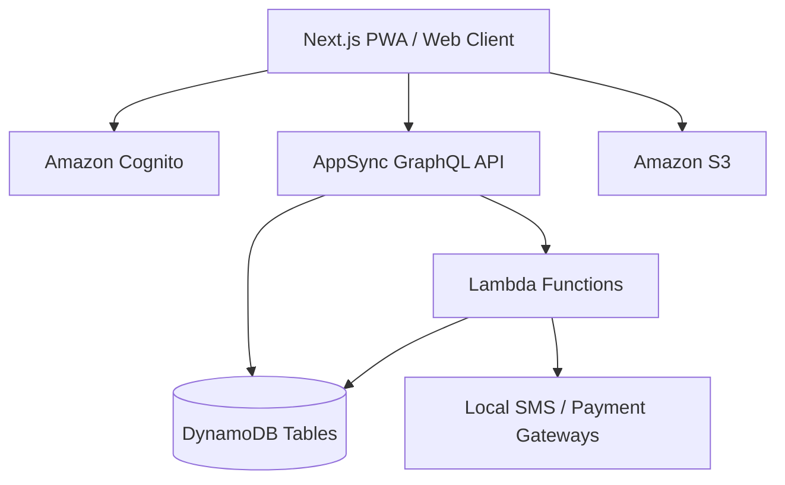

# Technical Implementation & Development Plan

This document outlines the recommended technology stack, architecture, and step-by-step development phases for the appointment booking platform. The goal is to build a scalable, maintainable system that can handle future growth without requiring a complete rewrite.

## User Review Required

We have finalized the technical selection (AWS Amplify Gen 2 with DynamoDB). Are there any final questions regarding the system architecture or data model before we transition into Phase 1: Core Foundation & MVP? If not, we can begin setting up the Next.js project and the Amplify backend.

### 1. Technology Stack Selection: AWS Ecosystem

Based on your decision to focus on learning and leveraging the AWS ecosystem, we are proceeding with a modern, serverless AWS architecture centered around **AWS Amplify Gen 2**.

#### 1.1 Core Frontend Stack
*   **Framework:** Next.js (React)
*   **Styling:** Tailwind CSS + shadcn/ui
*   **Language:** TypeScript

#### 1.2 Backend & Infrastructure (AWS Amplify Gen 2)
*   **Authentication:** Amazon Cognito (Serverless, scales automatically, massive free tier).
*   **API Layer:** AWS AppSync (GraphQL).
*   **Database:** Amazon DynamoDB (NoSQL) **or** MongoDB Atlas (if moving away from pure Amplify).
    *   *Can the project in the deep research report be achieved with NoSQL?* Yes. In fact, many modern, highly-scaled booking systems (like portions of Calendly or Uber's scheduling) use NoSQL because it handles massive read/write volumes better than traditional SQL.
    *   *How NoSQL handles your complex features:*
        1.  **Multi-branch / Staff Roles:** In NoSQL (DynamoDB or MongoDB), you embed data or use secondary indexes. You don't perform complex SQL `JOINs`. Instead, a "Business" document contains an array of "Branch IDs" and "Staff IDs," allowing you to query "Give me all staff for Branch X" in milliseconds.
        2.  **Queue Management / Walk-ins:** NoSQL is *perfect* for this. A queue is just a fast-changing list. DynamoDB/MongoDB can append a walk-in user to a daily "Queue Document" instantly without locking an entire relational database table.
        3.  **Packages & Memberships:** A user's document simply gets an array: `activeMemberships: [{type: 'Haircut10', remaining: 8}]`. When they book, you decrement the number. This is natively fast in NoSQL.
    *   *Is it good for the long term?* Yes. AWS built its entire retail business on DynamoDB because SQL couldn't scale to their Black Friday traffic. If you structure your "Access Patterns" (how you plan to read the data) correctly up front, NoSQL will scale indefinitely.
*   **Compute:** AWS Lambda (For cron jobs, payment webhooks, or complex slot calculations).
*   **Storage:** Amazon S3 (Profile pictures, service images).
*   **Hosting:** AWS Amplify Hosting (Automated CI/CD from GitHub).

#### 1.3 Communication & Integrations
*   **SMS/Notifications:** AWS SNS or local REST APIs via Lambda.
*   **Payments:** Local PSP (PayHere, etc.).

### 2. System Architecture Overview

The system will utilize a modern serverless architecture:

### 3. Step-by-Step Implementation Plan (A to Z)

To ensure we build this platform incrementally—where every step produces a working, testable piece of software—we will follow a strict, granular execution plan. This order is specifically structured to solve the "Chicken and Egg" problem you identified in the Deep Research Report, focusing on making the product useful for *Businesses* first, before building out complex *Consumer* discovery tools.

#### Phase 1: The Core Booking Engine (Weeks 1-4)
*Goal: A business can register, define their hours, and share a link where a user can successfully book an appointment without double-booking.*

1.  **Step 1: Project Initialization & Foundations**
    *   Set up Next.js App Router (TypeScript, Tailwind CSS, shadcn/ui).
    *   Initialize AWS Amplify Gen 2 (configure auth, data, and storage environments).
    *   Deploy the initial empty shell via Amplify Hosting to ensure CI/CD is working.
2.  **Step 2: Authentication (Cognito)**
    *   Implement user registration/login flow (email/password initially, adding phone number verification later as per the SL context in the report).
    *   Create separate role flows: `Customer` vs. `Business Owner`.
3.  **Step 3: Database Modeling & Schema (DynamoDB)**
    *   Define the core data models in `amplify/data/resource.ts`: `User`, `BusinessProfile`, `Service`, `Appointment`, and `OperatingHours`.
4.  **Step 4: Business Onboarding & Profile Setup**
    *   Build the UI for businesses to complete their profile (Name, Location, Phone).
    *   Implement logic for businesses to set their `OperatingHours` (e.g., Mon-Fri 9 AM-5 PM).
5.  **Step 5: Service Management**
    *   Build the dashboard where businesses can Create, Read, Update, and Delete (CRUD) the services they offer (e.g., "Haircut - 30 mins - LKR 1000").
6.  **Step 6: The Consumer Booking UI (The Core Loop)**
    *   Build the public `/[businessName]` page.
    *   Implement the dynamic calendar UI.
    *   **Crucial Logic:** Write the algorithm that queries DynamoDB for existing `Appointments` on a given date, compares it to the business's `OperatingHours` and `Service` duration, and mathematically outputs the *available* time slots.
    *   Implement the mutation to save a new `Appointment`.
7.  **Step 7: Basic Dashboard Management**
    *   A simple table view for businesses to see upcoming `Appointments` and change their status (`Confirmed`, `Cancelled`, `Completed`).

#### Phase 2: Trust, Reliability, & Notifications (Weeks 5-8)
*Goal: Make the platform reliable enough for a real-world pilot release (5-10 businesses, as mentioned in your report).*

8.  **Step 8: The Notification Engine**
    *   Integrate basic email notifications (via AWS SES or Resend) for booking confirmations sent to both the customer and the business.
    *   Add SMS confirmations (exploring AWS SNS vs local Dialog/Mobitel gateways).
9.  **Step 9: Advanced Scheduling (Handling Edge Cases)**
    *   Add the ability for businesses to block out specific dates/times (e.g., "Closed for Poya day" or "Lunch break").
    *   Implement buffer times (e.g., a 10-minute gap automatically added between appointments).
10. **Step 10: Multi-Staff / Branch Support (Foundation)**
    *   Modify the data models so a single `BusinessProfile` can have multiple `StaffMembers`, each with their own calendar and overlapping appointments.
11. **Step 11: Queue Management / Walk-ins**
    *   Build a fast-entry UI for businesses to manually add walk-in customers to the daily schedule alongside online bookings.

#### Phase 3: Monetization & Complex Features (Weeks 9-12)
*Goal: Implement revenue-generating features and localization.*

12. **Step 12: Localization (Sinhala & Tamil)**
    *   Implement Next.js i18n routing to support English, Sinhala, and Tamil translations across the primary consumer interfaces.
13. **Step 13: Automated Reminders (Reducing No-Shows)**
    *   Set up AWS EventBridge cron jobs to trigger AWS Lambda functions that scan the database for appointments happening in 24 hours and send automated SMS reminders.
14. **Step 14: Payment Integration (Local Options)**
    *   Integrate a Sri Lankan payment gateway (e.g., PayHere) to allow businesses to mandate upfront deposits or full payments during the booking flow.
15. **Step 15: Packages & Memberships**
    *   Implement the data structure to track pre-paid bundles (e.g., "10 Yoga Classes") and decrement the count upon booking.

#### Phase 4: Discovery & Scale (Month 4+)
*Goal: Evolve from a B2B SaaS tool into a B2C Discovery Marketplace.*

16. **Step 16: The Consumer Marketplace Home Page**
    *   Build the centralized search and filtering UI (search by location, service category, ratings) so users can discover *new* businesses.
17. **Step 17: Reviews and Ratings**
    *   Implement post-appointment emails asking for a 1-5 star review, and display aggregate scores on business profiles.
18. **Step 18: Advanced Analytics**
    *   Build charts in the business dashboard showing daily booking volume, revenue, and no-show rates.
19. **Step 19: Offline / USSD Fallback (Research & Dev)**
    *   As noted in your report for rural adoption, begin investigating SMS-based booking interactions utilizing local telco APIs.

### 4. Why This Order?

We are building the "SaaS tool" first (Phases 1-3) so businesses can use this to manage their *existing* customers. This solves the cold-start problem. Only after you have hundreds of businesses already forcing their customers onto the platform via WhatsApp links do we build the "Discovery App" (Phase 4) for users to browse and find new places.

## Verification Plan

### Automated Tests
*   **Unit Tests:** Jest or Vitest for core business logic (e.g., calculating available time slots based on business hours and existing bookings).
*   **E2E Tests:** Cypress or Playwright to test the critical user journeys (e.g., User registers -> Business creates service -> User books service).
*   **AWS Amplify Gen 2 sandbox:** Use the local sandbox environment to test AppSync resolvers and Lambda functions before deploying to the cloud.

### Manual Verification
*   **Pilot Launch (Phase 2):** Deploy MVP to a staging environment and onboard 5-10 actual local businesses (salons/clinics) to use the system with their real clients. Gather feedback on UX, performance on local 3G/4G networks, and translation accuracy.
*   **Payment Gateway Sanity Checks:** Manually process test transactions linking to a Sandbox account (e.g., PayHere Sandbox) before switching to production keys.
